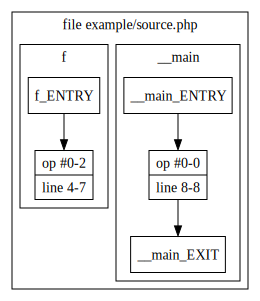
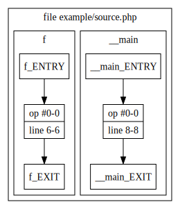

[](https://unmaintained.tech/)
[](https://github.com/sebastianbergmann/foal/actions)
[](https://codecov.io/gh/sebastianbergmann/foal)

# Find Optimized-Away Lines (FOAL)

`foal` finds lines of code that are eliminated by OpCache's bytecode optimizer.

## Installation

The recommended way to use this tool is a [PHP Archive (PHAR)](https://php.net/phar):

```bash
$ wget https://phar.phpunit.de/foal.phar

$ php foal.phar --version
```

Furthermore, it is recommended to use [Phive](https://phar.io/) for installing and updating the tool dependencies of your project.

## Usage

**`example.php`**
```php
<?php declare(strict_types=1);
function f()
{
    $result = 'result';

    return $result;
}
```

### Default Output
```
$ php foal.phar example.php
foal 0.4.0 by Sebastian Bergmann.

  1      <?php declare(strict_types=1);
  2      function f()
  3      {
- 4          $result = 'result';
  5      
  6          return $result;
- 7      }
```

Lines prefixed with `-` were optimized away by the OpCache bytecode optimizer.

### Graph Output
```
$ php foal.phar --paths example example/source.php             
foal 0.4.0 by Sebastian Bergmann.

Wrote execution paths for example/source.php to example/unoptimized.dot
Wrote optimized execution paths for example/source.php to example/optimized.dot
```
```
$ dot -Tsvg -o example/unoptimized.svg example/unoptimized.dot
$ dot -Tsvg -o example/optimized.svg example/optimized.dot
```

| Before Bytecode Optimization            | After Bytecode Optimization         |
|-----------------------------------------|-------------------------------------|
|  |  |
